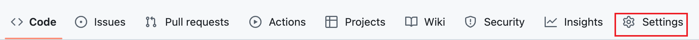
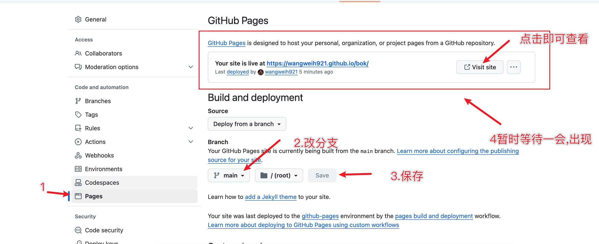

# 搭建一个博客

## 1.创建仓库并部署Github Pages

> Github pages将git仓库内的前段代码部署  ---- live in server

1. 创建仓库

2. 将静态项目提交到仓库中

   > github无法使用密码提交,需要配置ssh公钥

3. 点击setting

   

4. 找到page,执行如下配置

   + 点击部署分支

   + 保存后稍等片刻

   + 出现page site即可查看

     

5. 此页面是开源的,部署在github上的公网地址

## 2.Hexos

## 3.发布内容,并更新